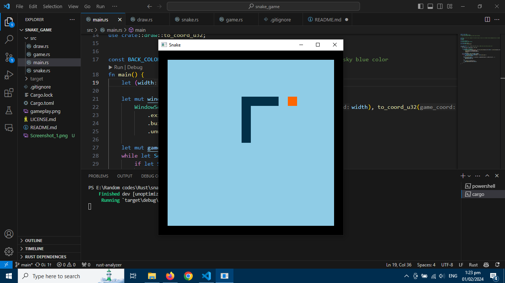

# Rust Snake Game

Welcome to the Rust Snake Game, a classic snake game implemented in the Rust system programming language. Below, you'll find instructions on how to run the game, controls, rules, and future improvements.



## How to Run

To play the game, follow these simple steps:

1. **Install Rust:**
   If you haven't installed the Rust development environment yet, you can do so by following the instructions [here](https://www.rust-lang.org/tools/install).
2. **Install Dependencies:**
   After installing Rust, navigate to the project directory in your terminal and install the required dependencies. You can do this by running:
   
   ```bash
   cargo build

3. **Run the Game:**
   Open your terminal and navigate to the project directory. Run the following command:

   ```bash
   cargo run

This command will compile and run the game for you. Enjoy!

## Game Controls & Rules

- Use the arrow keys on your keyboard to control the movement of the snake.
- Consume the apples that appear in the screen to increase the snake's length and strength.
- If the snake collides with the game border or itself, it's a game over.

## License

Copyright (c) 2024 arslanstack.

This project is licensed under [the MIT License](LICENSE.md). Feel free to contribute and enhance the game!